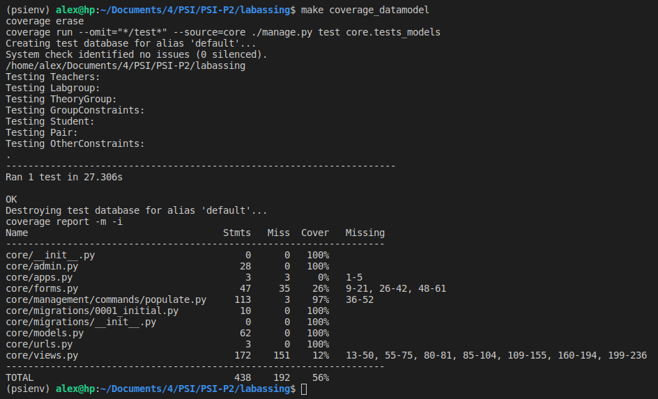
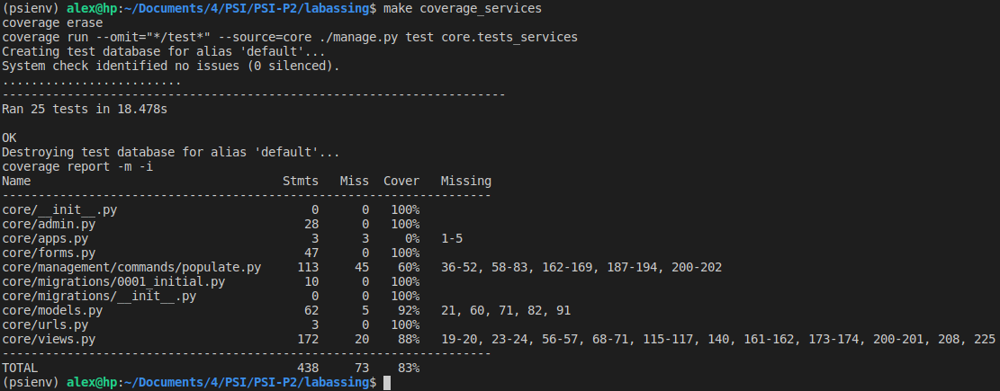

# PSI P3

## Realizado por :
- Alejandro Jiménez
- Jaime Muñoz

## Implementación

La práctica se ha desarrollado tal y como exigen los tests de referencia que se nos ha aportado. Debido a que el desarrollo es test driven no hay mucha holgura para implementaciones distintas.

## Datos importantes

Es importante tener en cuenta que nuestro [populate.py](core/management/commands/populate.py) utiliza directamente el archivo [auxiliary_info.txt](core/management/commands/auxiliary_info.txt) para rellenar los modelos que no se pueden rellenar desde los archivos **.csv**. Por tanto es necesario este archivo para el correcto funcionamiento del populate.

## Estilo

Para dar estilo de una forma rápida y eficiente hemos optado por el uso de **Bootstrap**. Ha resultado una muy buena idea ya que es sencillo de utilizar y agiliza mucho el proceso de diseño obteniendo resultados estéticos y funcionales.

## Tests

Todos los tests han sido satisfechos por el código. Y toda la funcionalidad pedida ha sido comprobada también desde el navegador de forma exhaustiva. Aquí se puede ver el resultado de ejecutar los tests.

### test_datamodel

### test_services

## Heroku

La práctica está desplegada en heroku y se puede acceder a ell a través del siguiente enlace: https://labassing.herokuapp.com/